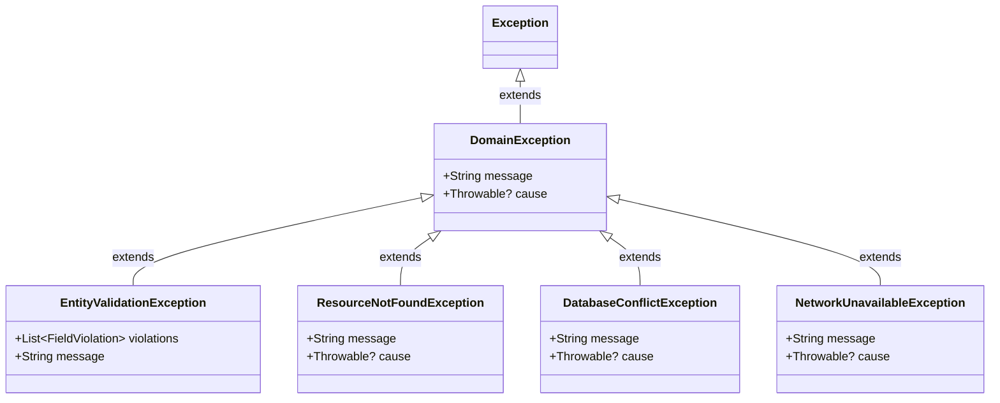

# ByteBloom Academy: Binary Knights - Logistics Engine

Welcome to the **Binary Knights Logistics & Routing Engine** project. This system provides core logistics algorithms, graph routing, cargo consolidation, and CRUD operations for warehouses, packages, routes, and vehicles.

---

## Architectural Error Strategy: Strategy A (Functional Style)

As part of **Sub-Task 4**, the team has formally evaluated two architectural error handling paradigms:
- **Strategy A (Functional Style)**: Wrap repository calls and use cases in Kotlin's standard `Result<T>` class (`runCatching`, `Result.success`, `Result.failure`), passing typed custom domain exceptions as failure causes, and handling outcomes via `onSuccess` and `onFailure` without `try/catch` blocks.
- **Strategy B (Legacy Exception Style)**: Catch low-level HTTP/SDK errors at repository boundaries, enrich them with diagnostic context, rethrow them as custom exceptions, and catch them at CLI boundaries.

### Team Decision: Formal Adoption of Strategy A (Functional Style)

Our team has formally adopted **Strategy A (Functional Style)** across the entire domain and use case architecture.

### Architectural Rationale

1. **Explicit Error Contracts**:
   - In traditional exception throwing (Strategy B), a method's type signature (`suspend fun invoke(): Warehouse`) disguises the fact that it can fail, hiding failure modes from callers.
   - With Kotlin's `Result<T>` (`suspend fun invoke(): Result<Warehouse>`), the potential for failure is a first-class citizen of the type system. Developers cannot accidentally ignore errors.

2. **Functional Composability without Boilerplate**:
   - Strategy A leverages functional primitives such as `.fold()`, `.onSuccess()`, `.onFailure()`, `.map()`, and `.mapCatching()`.
   - Eliminates nested, noisy `try/catch` blocks that clutter business logic and obscure the happy path.

3. **Safe Boundary Isolation**:
   - Repository operations and entity instantiations are safely guarded with `runCatching`. Any unexpected runtime error or infrastructure fault is captured and converted into a typed domain failure rather than crashing coroutines or threads.

4. **Predictable Control Flow**:
   - Exceptions are treated as data values rather than control-flow jumps. This makes the codebase easier to reason about, test, and debug.

---

## Typed Custom Domain Exception Hierarchy

Defined under package `domain.exception`:



### Exception Classes
- **`DomainException`**: The root `sealed class` for all domain-level exceptions, extending Kotlin's standard `Exception`.
- **`EntityValidationException`**: Encapsulates one or more `FieldViolation` objects. Used whenever an input or model fails business or formatting constraints.
- **`ResourceNotFoundException`**: Dispatched when an entity with a specific identifier cannot be located in storage.
- **`DatabaseConflictException`**: Dispatched when a database create, update, or delete operation fails or encounters conflicts.
- **`NetworkUnavailableException`**: Dispatched when remote network or PostgREST communication is unreachable.

---

## Error Accumulation in Validation & Model Creation

Rather than "failing fast" on the very first invalid property, all validators and domain models accumulate **every single violation** before reporting errors.

### 1. `FieldViolation` & `ValidationResult`
```kotlin
data class FieldViolation(val field: String, val message: String)

sealed class ValidationResult {
    data object Valid : ValidationResult()
    data class Invalid(val violations: List<FieldViolation>) : ValidationResult()

    val isValid: Boolean get() = this is Valid
    val isInvalid: Boolean get() = this is Invalid
    fun errorsOrNull(): List<FieldViolation>? = (this as? Invalid)?.violations
}
```

### 2. Model Creation with All Accumulated Errors
Domain models (`Warehouse`, `Package`, `Route`, `Vehicle`) validate all fields during instantiation:
- If invalid fields are detected, an `EntityValidationException` containing the complete list of `violations` is thrown.
- Models also provide a functional companion factory method (`Model.create(...) : Result<Model>`), returning a failure `Result` wrapping `EntityValidationException`.

**Example:**
```kotlin
val result = Warehouse.create(
    id = "INVALID",
    name = "",
    regionalZone = "",
    latitude = 100.0,
    longitude = -200.0
)

result.onFailure { error ->
    if (error is EntityValidationException) {
        // Contains violations for id, name, regionalZone, latitude, and longitude
        error.violations.forEach { println("${it.field}: ${it.message}") }
    }
}
```

---

## CRUD Use Case Implementation Patterns

CRUD use cases across `domain.usecase.crud.*` follow the uniform Strategy A pipeline:

1. Validate input using dedicated validator -> if invalid, immediately return `Result.failure(EntityValidationException(violations))`.
2. Construct domain entity wrapped in `runCatching` -> catches any validation error and returns `Result.failure`.
3. Invoke repository operation wrapped in `runCatching`.
4. Fold on repository result:
   - On success: return `Result.success(entity)` or `Result.failure(DatabaseConflictException(...))` if operation failed.
   - On failure: return `Result.failure(DatabaseConflictException(..., cause))`.

### Example Use Case Consumption (CLI / UI Boundary)
```kotlin
createWarehouseUseCase(input)
    .onSuccess { warehouse ->
        println("Successfully created warehouse: ${warehouse.name} (${warehouse.id})")
    }
    .onFailure { error ->
        when (error) {
            is EntityValidationException -> {
                println("Validation errors detected:")
                error.violations.forEach { println(" - ${it.field}: ${it.message}") }
            }
            is DatabaseConflictException -> println("Database error: ${error.message}")
            is ResourceNotFoundException -> println("Not found: ${error.message}")
            else -> println("Unexpected error: ${error.message}")
        }
    }
```
