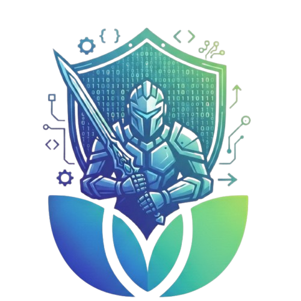

<div align="center">

<table>   <tr>     <td width="12%" align="center"></td>     <td width="76%" align="center">            </td>     <td width="12%" align="center"></td>   </tr> </table>

<br>

  
  
  


<br><br>

*Governance rules, coding standards, communication protocols, testing standards, and architecture guidelines that apply to every task built in this repository.*

</div>

---

## Team Membership

The current Binary Knights team consists of five active members:

| # | Member          | Role                                | Primary Responsibility                                                               |
| - | --------------- | ----------------------------------- | ------------------------------------------------------------------------------------ |
| 1 | Ahmed Farani    | Team Lead & Repository Governance   | Integration, Git governance, milestones, and final technical coordination.           |
| 2 | Ibrahim Salha   | Clean Code Owner                    | Kotlin conventions, readability, formatting, and code-quality consistency.           |
| 3 | Kamal Ashour    | Architecture Owner                  | Clean Architecture, package boundaries, repository contracts, and project structure. |
| 4 | Fatima Abu Azab | Communication & Documentation Owner | Team coordination, documentation, task tracking, and communication standards.        |
| 5 | Tariq Zeyad     | QA & Algorithms Owner               | Testing, algorithm verification, edge cases, and runtime-behavior validation.        |

### Membership Update

Sabah Baraka has left the team.

Fatima Abu Azab and Tariq Zeyad have joined the team.

The Team Charter has therefore been updated to reflect the current five-member Binary Knights team.

---

## Table of Contents

* [1. Workflow, Team Roles & Git Governance](#1-workflow-team-roles--git-governance)

  * [1.1 Team Roles Outline](#11-team-roles-outline)
  * [1.2 Selected Branching Model](#12-selected-branching-model)
  * [1.3 Commit Message Prefixes](#13-commit-message-prefixes)
* [2. Clean Code Standards](#2-clean-code-standards)

  * [2.1 Naming Conventions](#21-naming-conventions)
  * [2.2 Code Structure Guidelines](#22-code-structure-guidelines)
* [3. Communication & Documentation](#3-communication--documentation)

  * [3.1 Communication Channels](#31-communication-channels)
  * [3.2 Team Meetings](#32-team-meetings)
  * [3.3 Documentation Rules](#33-documentation-rules)
* [4. Architecture & Repository Guidelines](#4-architecture--repository-guidelines)

  * [4.1 Clean Architecture](#41-clean-architecture)
  * [4.2 Target Directory Model](#42-target-directory-model)
  * [4.3 Repository Boundary](#43-repository-boundary)
  * [4.4 Gitignore](#44-gitignore)
* [5. Testing & Algorithm Verification](#5-testing--algorithm-verification)

  * [5.1 Testing Rules](#51-testing-rules)
  * [5.2 Algorithm Verification](#52-algorithm-verification)
  * [5.3 Definition of Done](#53-definition-of-done)
* [6. Current Project Architecture](#6-current-project-architecture)

  * [6.1 Algorithms](#61-algorithms)
  * [6.2 Design Patterns](#62-design-patterns)
  * [6.3 Network Resilience](#63-network-resilience)

---

## 1. Workflow, Team Roles & Git Governance

### 1.1 Team Roles Outline

| Member              | Responsibility                                                                                |
| ------------------- | --------------------------------------------------------------------------------------------- |
| **Ahmed Farani**    | Repository governance, milestone coordination, integration, and final technical coordination. |
| **Ibrahim Salha**   | Kotlin naming, readability, formatting, and Clean Code consistency.                           |
| **Kamal Ashour**    | Clean Architecture, repository boundaries, package structure, and architectural consistency.  |
| **Fatima Abu Azab** | Team communication, documentation, task tracking, and maintaining project information.        |
| **Tariq Zeyad**     | Testing, algorithm correctness, edge cases, and runtime verification.                         |

Every member is responsible for understanding changes that affect the shared codebase, even when the change belongs primarily to another member's responsibility.

### 1.2 Selected Branching Model

The repository uses the existing Git Flow Lite workflow:

* **`main`** — stable release branch.
* **`develop`** — integration branch where completed work is validated.
* **`feature/*`** — temporary branches for isolated assignments when required.

Integration rules:

* Feature work is integrated into `develop` through Pull Requests.
* Pull Requests require at least one peer approval.
* `develop` is promoted to `main` only after the current milestone is stable and CI passes.
* Direct changes to `main` are not allowed for normal feature work.

### 1.3 Commit Message Prefixes

| Prefix      | Used for                                                   |
| ----------- | ---------------------------------------------------------- |
| `feat:`     | New features or domain behavior.                           |
| `fix:`      | Bug fixes and corrections.                                 |
| `refactor:` | Internal restructuring without changing intended behavior. |
| `test:`     | Tests and verification changes.                            |
| `docs:`     | Documentation and Team Charter changes.                    |
| `chore:`    | Tooling, configuration, or repository maintenance.         |

---

## 2. Clean Code Standards

### 2.1 Naming Conventions

| Element    | Convention                             |
| ---------- | -------------------------------------- |
| Classes    | PascalCase                             |
| Functions  | camelCase                              |
| Variables  | camelCase                              |
| Parameters | camelCase                              |
| Constants  | UPPER_SNAKE_CASE                       |
| Use Cases  | Verb-based names ending with `UseCase` |

### 2.2 Code Structure Guidelines

1. Keep each class focused on one responsibility.
2. Keep functions small and easy to understand.
3. Prefer `val`; use `var` only when mutation is required.
4. Avoid duplicated business logic.
5. Avoid unused code and dead dependencies.
6. Comments should explain why, not repeat what the code already expresses.
7. Extract repeated or complex logic into focused functions or classes.
8. Avoid magic numbers by using named constants when values represent business meaning.
9. Prefer expressive Kotlin collection operations when they improve clarity.
10. Format Kotlin code before committing.

---

## 3. Communication & Documentation

### 3.1 Communication Channels

* **WhatsApp** — daily communication and urgent coordination.
* **Trello** — task ownership, progress, checklists, and planning.
* **GitHub Issues** — bugs, technical tasks, and tracked decisions when needed.
* **GitHub Pull Requests** — implementation review and integration discussion.

### 3.2 Team Meetings

* The team maintains regular synchronization according to the academy schedule.
* Important decisions, blockers, and task changes should be communicated to the entire team.
* Members who cannot attend a meeting should provide their update asynchronously.

### 3.3 Documentation Rules

* Architecture decisions affecting multiple packages should be documented.
* README and Team Charter information must reflect the current project state.
* New features should include enough explanation for another team member to understand their purpose and usage.
* Documentation changes must remain consistent with the actual implementation.

---

## 4. Architecture & Repository Guidelines

### 4.1 Clean Architecture

The project follows a layered architecture:

```text
UI
 ↓
Use Cases
 ↓
Domain Models / Domain Algorithms / Domain Services
 ↓
Repository Interfaces
 ↓
Data Repository Implementations
 ↓
CSV / External Data Sources
```

Dependency rules:

* `domain` must not depend on concrete `data` implementations.
* Repository contracts belong to the domain layer.
* Raw CSV DTOs belong to the data layer.
* CSV parsing belongs to the data layer.
* Concrete CSV repositories belong to the data layer.
* Domain algorithms work with domain models and repository interfaces.
* UI is responsible for composition, wiring, and presentation.
* Business operations should be exposed through dedicated Use Cases where applicable.

### 4.2 Target Directory Model

```text
src/main/
├── kotlin/
│   ├── data/
│   │   ├── dataholder/
│   │   ├── mapper/
│   │   ├── reader/
│   │   ├── repository/
│   │   └── utils/
│   │
│   ├── domain/
│   │   ├── algorithm/
│   │   ├── builder/
│   │   ├── command/
│   │   ├── decorator/
│   │   ├── model/
│   │   ├── pricing/
│   │   ├── repository/
│   │   ├── ring/
│   │   ├── tree/
│   │   ├── usecase/
│   │   └── util/
│   │
│   └── ui/
│
└── resources/
    ├── warehouses.csv
    ├── routes.csv
    ├── packages.csv
    └── fleet.csv
```

### 4.3 Repository Boundary

All domain-facing data access must pass through repository interfaces.

Concrete CSV repositories are responsible for:

* Reading CSV files.
* Parsing raw records.
* Mapping raw DTOs into domain models.
* Resolving domain object references.
* Returning domain objects through repository interfaces.

Domain code must not directly depend on:

```text
WarehouseRaw
PackageRaw
RouteRaw
VehicleRaw
CsvFileReader
```

### 4.4 Gitignore

Generated build outputs, IDE metadata, compiler artifacts, and operating-system files must remain excluded through the root `.gitignore`.

The repository should not contain:

```text
.gradle/
build/
out/
*.iml
.idea/libraries/
.vscode/
.DS_Store
Thumbs.db
```

---

## 5. Testing & Algorithm Verification

### 5.1 Testing Rules

Before a feature is considered complete:

1. The project must compile successfully.
2. Existing behavior must remain intact unless intentionally changed.
3. New business logic should have focused tests where practical.
4. Edge cases must be considered explicitly.
5. Runtime demos should produce sensible results using the real dataset.
6. CI Build/Test must pass.
7. Detekt must pass before release.

### 5.2 Algorithm Verification

The project demonstrates:

* **BFS / Least-Hop Routing** — shortest route by number of hops.
* **Bidirectional BFS** — searches from both directions.
* **Dijkstra** — weighted optimal routing.
* **Quick Sort / package ordering** — package/cargo ordering.
* **BST** — unbalanced tree search behavior.
* **AVL Tree** — balanced tree search behavior.
* **Consistent Hashing** — deterministic package-to-slot assignment and clockwise failover.
* **Network Resilience BFS Traversal** — evaluates network connectivity after a single warehouse breakdown.

Algorithm verification should consider:

* Normal cases.
* Empty input.
* Single-node input.
* Unreachable destinations.
* Broken/removed nodes.
* Zero-capacity vehicles where applicable.
* Malformed or incomplete data.
* Expected time complexity.

### 5.3 Definition of Done

A task is complete when:

* The implementation is located in the correct layer/package.
* Clean Architecture dependency rules are respected.
* The relevant Use Case is used where applicable.
* Repository interfaces are respected.
* Existing algorithms are reused instead of unnecessarily duplicated.
* Edge cases are handled.
* Code is readable and formatted.
* Relevant tests or runtime verification have been performed.
* CI Build/Test passes.
* Detekt passes.
* Documentation is updated when architecture or behavior changes.

---

## 6. Current Project Architecture

### 6.1 Algorithms

The routing subsystem exposes a common abstraction:

```text
ShortestPathRouter
       │
       ├── LeastHopRouter
       │      └── BFS
       │
       ├── OptimalTransitRouter
       │      └── Dijkstra
       │
       └── BidirectionalBfsRouter
              └── Bidirectional BFS
```

Tree analysis demonstrates:

```text
Unbalanced BST
      vs
Balanced AVL Tree
```

Consistent hashing demonstrates deterministic slot assignment and clockwise failover.

### 6.2 Design Patterns

The project currently demonstrates:

```text
Repository Pattern
Strategy Pattern
Decorator Pattern
Command Pattern
Builder Pattern
```

#### Repository

Separates domain contracts from CSV implementations.

#### Strategy

Allows different pricing strategies such as:

```text
EcoStrategy
ExpressStrategy
FragileStrategy
```

#### Decorator

Adds optional package services dynamically:

```text
Base Package
 ↓
Insurance
 ↓
Cold Chain
 ↓
Fragile Handling
```

#### Command

Encapsulates vehicle dispatch operations and supports undo/history.

#### Builder

Constructs the domain graph and warehouse hierarchy.

### 6.3 Network Resilience

The resilience analysis simulates a Single Point of Failure for each warehouse.

Conceptually:

```text
Warehouse X fails
        ↓
Remove X from traversal
        ↓
Traverse the remaining graph
        ↓
Check whether every remaining warehouse is reachable
        ↓
Failure survives OR network disconnects
        ↓
Calculate survivable failures / total failures
        ↓
Resilience percentage
```

The current graph-based implementation also resolves warehouse references through an internal lookup and considers incoming and outgoing connections during the connectivity traversal.

---

<div align="center">

<table>
  <tr>
    <td width="12%" align="center"></td>
    <td width="76%" align="center"></td>
    <td width="12%" align="center"></td>
  </tr>
</table>

</div>
